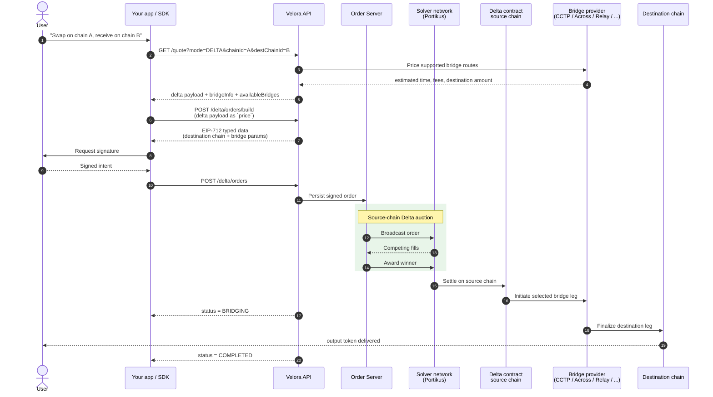

Crosschain Delta lets a user sign one intent on the source chain and receive the output token on another chain. Delta prices the source-chain swap, selects a supported bridge route, encodes the bridge parameters into the signed order, and tracks the destination leg until completion.

Use it when you want the Delta execution model — gasless signing, private solver competition, and MEV protection — across chains.

## The bridge flow at a glance



## When to use this

Use crosschain Delta when:

- The user starts on one supported EVM chain and wants output on another.
- You want one user signature instead of a manual swap, bridge, and destination-chain claim flow.
- Your integration already uses Delta orders and can pass the `delta` quote block through to `POST /delta/orders/build` unchanged.
- You can show bridge-specific timing clearly: destination delivery is asynchronous after source-chain settlement.

Keep same-chain Delta for routes where `chainId` and `destChainId` are the same or where no supported bridge route is available.

## What changes from same-chain Delta

The integration shape stays close to the standard [Delta flow](/delta/how-it-works). The main difference is that the quote and order include a bridge leg.

- Add `destChainId` to `GET /quote`. `chainId` remains the source chain.
- Request `mode=DELTA` for crosschain quotes. Market mode is same-chain execution.
- Treat the returned `delta` block as the source of truth. Pass it verbatim into `POST /delta/orders/build`.
- Read `delta.bridgeInfo` for the selected bridge route: protocol name, estimated time, destination amount after bridge, and fees.
- Use `delta.availableBridges` when you want to show alternative bridge routes.
- After source-chain settlement, expect an intermediate `BRIDGING` state before `COMPLETED`.

<Warning>
  Do not recompute or hand-edit the bridge payload. The bridge parameters are covered by the quote integrity envelope and the signable order.
</Warning>

## Quickstart

Request a Delta quote with a destination chain:

```bash cURL
curl -G "https://api.velora.xyz/quote" \
  --data-urlencode "srcToken=0xEeeeeEeeeEeEeeEeEeEeeEEEeeeeEeeeeeeeEEeE" \
  --data-urlencode "srcDecimals=18" \
  --data-urlencode "destToken=0xa0b86991c6218b36c1d19d4a2e9eb0ce3606eb48" \
  --data-urlencode "destDecimals=6" \
  --data-urlencode "amount=1000000000000000000" \
  --data-urlencode "side=SELL" \
  --data-urlencode "chainId=1" \
  --data-urlencode "destChainId=8453" \
  --data-urlencode "mode=DELTA" \
  --data-urlencode "userAddress=0xd8dA6BF26964aF9D7eEd9e03E53415D37aA96045" \
  --data-urlencode "partner=my-app-name"
```

Then use the same build, sign, and submit calls as a same-chain Delta order:

<Steps>
  <Step title="Build the order">
    Send the returned `delta` object as `price` in `POST /delta/orders/build`, together with its `hmac`.
  </Step>
  <Step title="Request the signature">
    Ask the user to sign the returned EIP-712 typed data. The typed data includes the destination chain and bridge parameters.
  </Step>
  <Step title="Submit and poll">
    Submit the order with `POST /delta/orders`, then poll the order endpoint until the status reaches a terminal state.
  </Step>
</Steps>

## How bridging works

Delta does not ask the user to perform a separate bridge transaction. The user signs a Delta order that already contains the selected destination chain, output token, and bridge execution data.

At settlement time, the winning solver executes the source-chain Delta order through Portikus. If the order is crosschain, the settlement module sends the post-swap output into the selected bridge module instead of transferring it locally to the user. The destination output is delivered to the order beneficiary on the destination chain.

For USDC routes, CCTP support is USDC-specific. Delta can still quote arbitrary source tokens when the source-chain leg swaps into the bridge token first, but the CCTP bridge leg itself moves USDC between supported chains.

<Note>
  Bridge times are estimates. Fast routes can be unavailable on some paths or when provider limits are reached. Always surface the quoted `estimatedTimeMs` and fees rather than hard-coding bridge assumptions.
</Note>

## Status model

Crosschain orders have one extra visible phase after source-chain execution:

- `PENDING` — the signed order is waiting for auction or settlement.
- `BRIDGING` — source-chain settlement succeeded and the bridge leg is being finalized.
- `COMPLETED` — the destination leg was observed as filled.
- `REFUNDED`, `EXPIRED`, or `FAILED` — the order did not complete as intended.

Source-chain bridge initiation is not the same as destination-chain completion. Only mark the user flow complete once the order status reaches `COMPLETED`.

## Implementation notes

- Use raw token units for amounts. Do not send decimal strings.
- `destToken` is the token address on `destChainId`.
- Native ETH-style assets use `0xEeeeeEeeeEeEeeEeEeEeeEEEeeeeEeeeeeeeEEeE`.
- Same-token routes may bridge directly. Other routes may swap first, then bridge the intermediate or destination asset.
- Some bridge providers expose alternatives with different speed, fee, and output tradeoffs. Show the selected route first and alternatives only when your UI supports a clear choice.

## Related pages

- [How Delta works](/delta/how-it-works) — the same-chain Delta lifecycle.
- [Delta quote endpoint](/api-reference/delta/quote) — quote parameters and response shape.
- [Order lifecycle & status codes](/delta/order-lifecycle-and-status-codes) — track `BRIDGING` and terminal states.
- [Trading modes](/integrate/trading-modes) — when to request Delta, Market, or automatic routing.
- [Chains and contracts](/resources/chains-and-contracts) — supported chains and public contract references.
