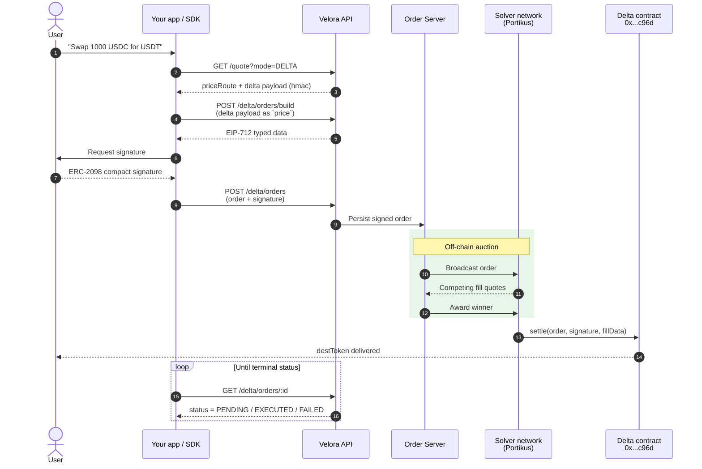

Delta separates **what the user wants** (the intent) from **how it gets executed** (the solver fill). The user signs once, off-chain. A competitive solver network on **Portikus** races to fill the order at the best price, then settles on-chain via the Delta contract.

## The flow at a glance

## The five stages

### 1. Quote

You call `GET /quote?mode=DELTA` (or `mode=ALL` to get both Market and Delta in one response). The API returns a `delta` payload containing the indicative price, the expected `destAmount`, the deadline, the partner-and-fee header, and an `hmac` you must pass through verbatim in step 2.

### 2. Build

You `POST /delta/orders/build` with the entire `delta` object from step 1 as the `price` field. The API returns EIP-712 typed data — domain (`name=Portikus, version=2.0.0, verifyingContract=0x...c96d`), types, and the order struct to sign.

<Warning>
  Pass the `delta` payload **verbatim**. Mutating any field (including `hmac`) will cause the build call to reject.
</Warning>

### 3. Sign

The user signs the typed data with their wallet. Delta uses **ERC-2098 compact signatures** (64 bytes, not 65). Most modern libraries — viem, ethers v6, wagmi — produce or accept compact sigs natively. The user pays **no gas** for this step; it's a pure off-chain message.

### 4. Auction

You `POST /delta/orders` with the order + signature. The order server persists it and broadcasts to the **Portikus solver network**. Solvers compete on price and execution quality. The winning solver commits to fill the order with their own capital — they take on inventory and settlement risk in exchange for the spread.

### 5. Settle

The winning solver calls `settle(...)` on the Delta contract (`0x0000000000bbF5c5Fd284e657F01Bd000933C96D`, same address on every supported chain). The contract verifies the signature, pulls `srcToken` from the user via the approved spender (the Delta contract itself), runs the fill, and delivers `destToken` to the user. You track progress via `GET /delta/orders/:id` until the order reaches a terminal status (`EXECUTED`, `EXPIRED`, or `FAILED`).

## Why this design

<CardGroup cols={2}>
  <Card title="Gasless for users" icon="gas-pump">
    Users sign off-chain. Solvers pay gas and recoup it from their margin.
  </Card>
  <Card title="MEV-protected" icon="shield">
    Orders are auctioned privately. There's no public mempool to sandwich.
  </Card>
  <Card title="Solver competition" icon="trophy">
    Solvers compete on price. The user always gets the best committed fill.
  </Card>
  <Card title="Atomic risk model" icon="lock">
    User funds only leave the wallet when settlement succeeds on-chain. No partial loss state.
  </Card>
</CardGroup>

## Related pages

- [Quickstart](/overview/quickstart) — run the flow end-to-end with cURL.
- [Order lifecycle & status codes](/delta/order-lifecycle-and-status-codes) — every status an order can reach.
- [EIP-712 typed data reference](/delta/eip-712-typed-data-reference) — exact domain, types, and struct layout.
- [Delta contract](/resources/chains-and-contracts) — on-chain entry point and per-chain addresses.
