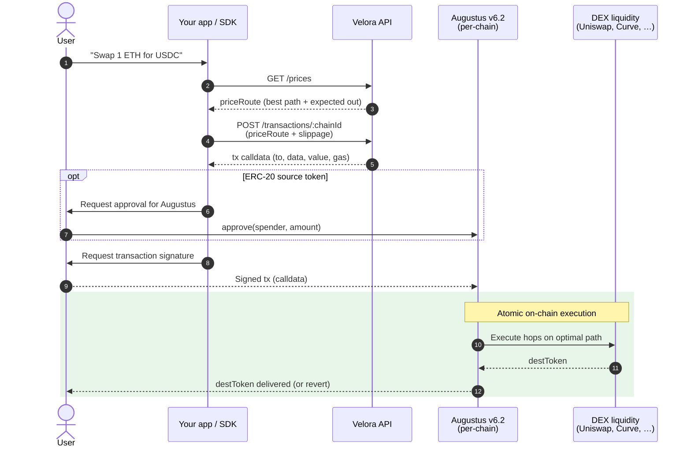

The Market API splits a swap into **price discovery** (off-chain) and **execution** (on-chain). You ask for a route, you build calldata against that route, and your user signs and broadcasts the transaction. Settlement is atomic — the swap either completes in one transaction or reverts.

## The flow at a glance

## The four stages

### 1. Price

You call `GET /prices` with `srcToken`, `destToken`, `amount`, `side` (`SELL` or `BUY`), and `network`. The aggregator scans liquidity across every DEX it supports on that chain, evaluates multi-hop and multi-DEX paths, and returns a `priceRoute` containing the best path, the expected `destAmount`, the gas estimate, and a USD breakdown (`srcUSD`, `destUSD`, `gasCostUSD`).

The `priceRoute` is **stateless and unsigned** — it's just a routing plan. It expires quickly (prices move) but holds no commitment.

### 2. Build

You `POST /transactions/:chainId` with the full `priceRoute` from step 1, the user's address, and a slippage tolerance. The API returns ready-to-broadcast calldata — `to` (the Augustus v6.2 router on that chain), `data` (encoded swap call), `value` (native token to send, if any), and a gas estimate.

<Warning>
  Pass the `priceRoute` **verbatim**. Mutating any field will cause the build call to reject.
</Warning>

### 3. Approve (ERC-20 only)

If the source token is an ERC-20, the user must approve the Augustus v6.2 router as a spender before the swap. This is a standard `approve(spender, amount)` call. Native source tokens (ETH, MATIC, etc.) skip this step — `value` is sent with the swap tx directly.

You can avoid this round-trip by passing `permit` or `permit2` data in the build call.

### 4. Settle

The user signs the swap transaction and broadcasts it. The Augustus router pulls `srcToken`, walks the path returned by the aggregator (each hop calls into the underlying DEX), checks the final `destAmount` against the user's `minDestAmount` (price × `1 − slippage`), and delivers `destToken` to the user. If any hop fails or slippage is exceeded, the entire transaction reverts — no partial-fill state.

## Why this design

<CardGroup cols={2}>
  <Card title="Atomic execution" icon="bolt">
    The swap completes in one transaction or reverts. No half-filled state to clean up.
  </Card>
  <Card title="Composable" icon="puzzle-piece">
    Augustus calldata can be wrapped in any contract call — vaults, batches, multicalls.
  </Card>
  <Card title="Best-price routing" icon="route">
    Multi-hop, multi-DEX paths across every venue the aggregator supports on each chain.
  </Card>
  <Card title="Full user control" icon="user-shield">
    The user signs and broadcasts. No off-chain solver custody, no auction delay.
  </Card>
</CardGroup>

## Related pages

- [Quickstart](/overview/quickstart) — run the flow end-to-end with cURL.
- [Market API reference](/api-reference/market/overview) — endpoints, parameters, response schemas.
- [Augustus router](/resources/chains-and-contracts) — per-chain router addresses.
