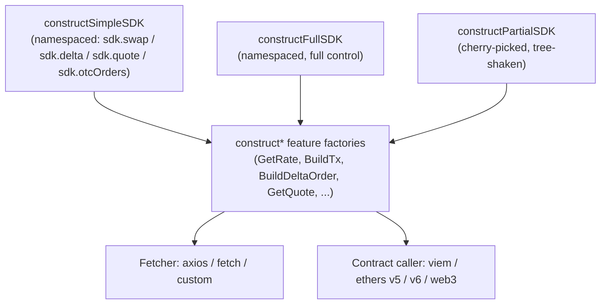

`@velora-dex/sdk` is a TypeScript SDK for the Velora API. It wraps the [Delta](/delta/overview) and [Market](/market/overview) endpoints into typed methods, leaves your wallet library (`viem`, `ethers`, or `web3`) and HTTP client (`axios` or `fetch`) up to you, and ships in three construction shapes so you only pay for what you import.

## What you get

<CardGroup cols={3}>
  <Card title="Versatile" icon="plug">
    Works with [viem](/sdk/configure-providers#viem),
    [ethers](/sdk/configure-providers#ethers-v5) (v5 or v6), or
    [web3.js](/sdk/configure-providers#web3-js). Bring whichever stack you
    already use.
  </Card>
  <Card title="Composable" icon="cubes">
    Three entry points (Simple, Full, Partial) over the same `construct*`
    primitives. Pick one to import only the methods you call.
  </Card>
  <Card title="Lightweight" icon="feather">
    10 KB gzipped for the minimal variant. Tree-shake the rest at build time.
  </Card>
</CardGroup>

## Quick example

Fetch a Delta-or-market quote and submit the order in one flow:

```ts
import axios from "axios";
import { createWalletClient, custom } from "viem";
import { mainnet } from "viem/chains";
import { constructSimpleSDK, txParamsToViemTxParams } from "@velora-dex/sdk";

const walletClient = createWalletClient({
  chain: mainnet,
  transport: custom(window.ethereum!),
});
const [account] = await walletClient.getAddresses();

const simpleSDK = constructSimpleSDK(
  { chainId: 1, axios },
  { viemClient: walletClient, account },
);

const USDC = "0xA0b86991c6218b36c1d19D4a2e9Eb0cE3606eB48";
const ETH = "0xEeeeeEeeeEeEeeEeEeEeeEEEeeeeEeeeeeeeEEeE";
const amount = "10000000000"; // 10,000 USDC
const slippageBps = 50; // 0.5%

const quote = await simpleSDK.quote.getQuote({
  srcToken: USDC,
  destToken: ETH,
  amount,
  userAddress: account,
  srcDecimals: 6,
  destDecimals: 18,
  mode: "all", // try Delta first, fall back to Market
  side: "SELL",
  partner: "my-app-name",
});

if ("delta" in quote) {
  await simpleSDK.delta.approveTokenForDelta(amount, USDC);
  const auction = await simpleSDK.delta.submitDeltaOrder({
    route: quote.delta.route,
    side: quote.delta.side,
    owner: account,
    slippage: slippageBps, // SDK applies slippage for you
    deadline: Math.floor(Date.now() / 1000) + 60 * 60, // required, unix seconds
    partner: "my-app-name",
  });
} else {
  const tx = await simpleSDK.swap.buildTx({
    srcToken: USDC,
    destToken: ETH,
    srcAmount: amount,
    slippage: slippageBps,
    priceRoute: quote.market,
    userAddress: account,
    partner: "my-app-name",
  });
  const hash = await walletClient.sendTransaction({
    ...txParamsToViemTxParams(tx),
    account,
  });
}
```

## How it works

All three entry points are thin orchestrators over the same per-method `construct*` factories. Pick the shape that matches how much of the SDK you actually use:



- **Simple** auto-wires the fetcher and contract caller from a single options object. Best for quickstarts and server-side scripts.
- **Full** exposes the same methods namespaced (`sdk.swap.*`, `sdk.delta.*`) but lets you construct the fetcher and caller yourself, including a custom transaction-response type.
- **Partial** is the tree-shaken variant: pass in only the `construct*` functions you import, and TypeScript infers the resulting SDK shape from your selection.

## Pick your starting point

<CardGroup cols={2}>
  <Card title="Install" icon="download" href="/sdk/install">
    Add `@velora-dex/sdk` and get the first quote in under five minutes.
  </Card>
  <Card
    title="Choose a variant"
    icon="code-branch"
    href="/sdk/choose-a-variant"
  >
    Simple vs Full vs Partial: bundle size, API shape, when to pick each.
  </Card>
  <Card title="Simple SDK" icon="bolt" href="/sdk/simple-sdk">
    One constructor, sensible defaults, every method available.
  </Card>
  <Card
    title="Configure providers"
    icon="sliders"
    href="/sdk/configure-providers"
  >
    Wire up viem, ethers, or web3, then choose your HTTP client.
  </Card>
</CardGroup>

## Related pages

- [Why Velora](/overview/why-velora): when to reach for the SDK vs the API or widget.
- [Migration from `@paraswap/sdk`](/resources/migrations/paraswap-sdk-to-velora-sdk): upgrade the legacy package to `@velora-dex/sdk`.
- [API reference](/api-reference/introduction) — the HTTP endpoints the SDK wraps.
