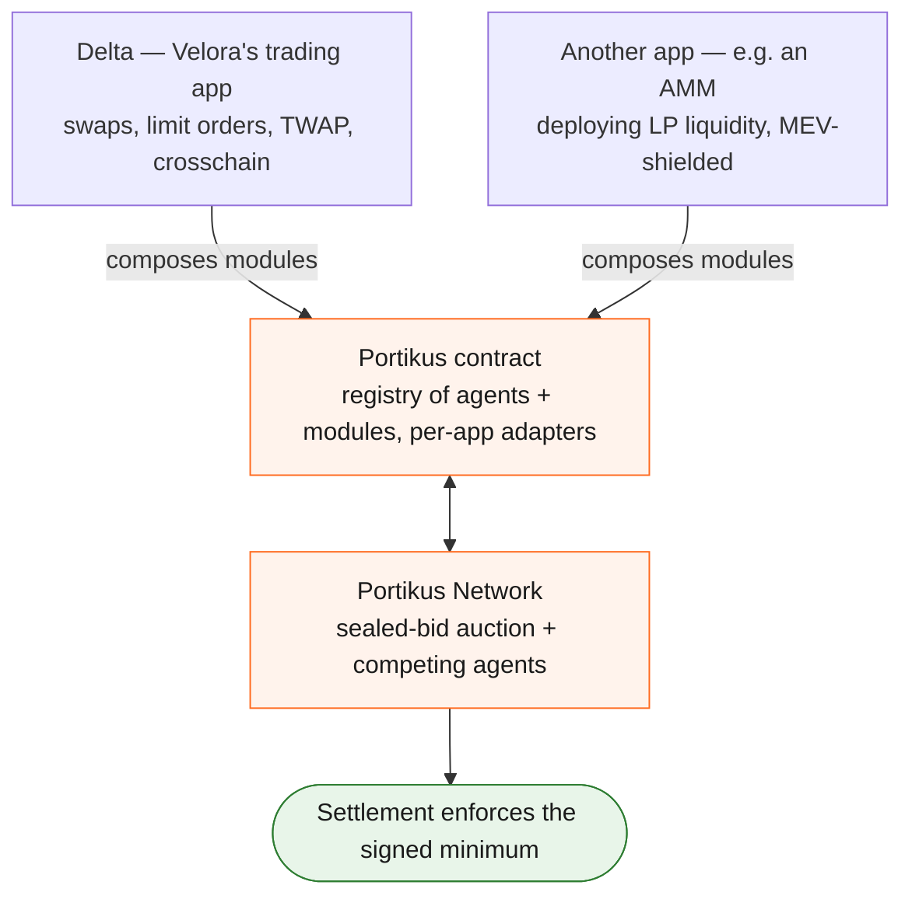
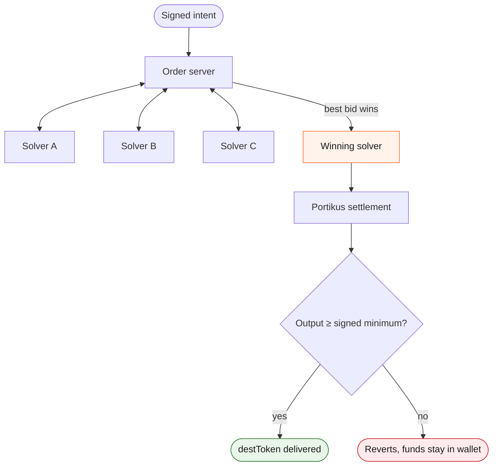
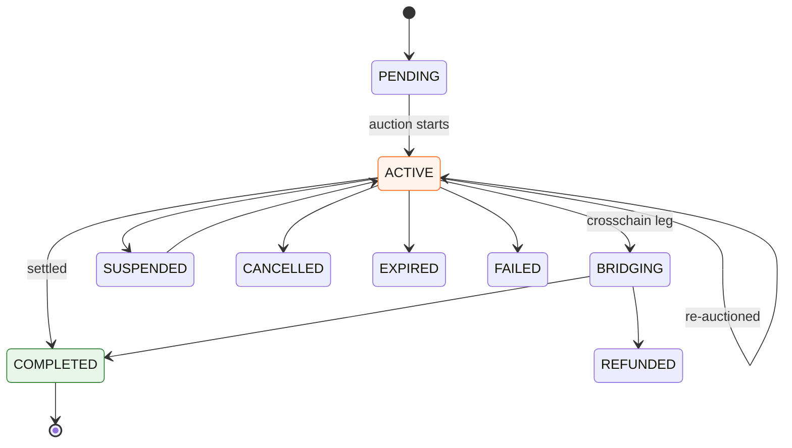

You sign *what you want* (sell 1,000 USDC for at least 999 USDT, on this chain, before this deadline), not *how to execute it*. That signed message is an **intent**.

[Portikus](https://www.portikus.xyz) is the infrastructure that turns intents into outcomes, built by [Laita Labs](https://www.laita.xyz/). It has three parts: an on-chain settlement layer, a set of composable modules apps build on, and the **Portikus Network**, where Portikus Agents compete to fill each intent.

Velora's Delta leverages Portikus for gasless, MEV-protected swaps, limit orders, TWAP, and crosschain. The same infrastructure can power other intent-based products too. A lending market or AMM, for example, could let its LPs rebalance and deploy capital through signed intents: competing agents fill each rebalance at a guaranteed price, the LP pays no gas, and nothing hits the public mempool to be front-run or sandwiched.

## One platform, many apps

Apps build on Portikus by composing modules on the Portikus contract and submitting signed intents. The shared Portikus Network fills any app's intents, and settlement enforces the terms the user signed.

Delta supplies the trading modules. A different app supplies its own (an LP module, a treasury module, whatever its product needs) and inherits the same solver competition and on-chain settlement guarantees. The rest of this page describes those shared parts, using Delta as the running example.

## Following a single intent

Each intent runs through a [sealed-bid auction](/solver-network/sealed-bid-auctions): solvers bid in parallel without seeing each other's offers, and the best bid wins the right to settle.

## Portikus Agents

Portikus Agents are the entities authorized to execute intents. An agent reads what the user signed for, works out how to deliver it, and settles it on-chain.

Agents specialize by business case, and an app runs the agents that fit its product. Delta's agents specialize in **spot trading**: they're the solvers that compete in the [sealed-bid auction](/solver-network/sealed-bid-auctions) to fill a swap at the best price. An app built for LP deployment would run agents specialized in that instead, on the same infrastructure.

A Delta solver commits to deliver the user's tokens, sourcing liquidity from its own inventory or on-chain routes. Most are professional DEX aggregators and market makers.

Agent permissions live on-chain. Solvers are the registered Portikus Agents authorized to execute intents; every agent address sits in the Portikus registry, and the settlement functions check it before executing. An address that was never registered, or was removed for misbehaving, cannot settle an intent at all.

## On-chain settlement

Whatever a solver does off-chain, the Portikus contract holds the same line on-chain:

- The signature is verified against the user's address (EIP-712), and the intent's nonce is consumed so it can never settle twice.
- The fill must deliver at least the `destAmount` the user signed. A fill that comes in below the minimum reverts; there is no partial-loss state.
- The deadline is checked at settlement. Past it, the intent is unfillable.
- Funds move only inside a successful settlement. Until the transaction lands, the user's tokens stay in their wallet.

## Order lifecycle

Each app exposes its own surface for tracking an intent. Delta's is the order status you poll with `GET /delta/v2/orders/{orderId}`, which moves from submission to a terminal state like this:

An intent that doesn't fill in one [auction round](/solver-network/sealed-bid-auctions#how-delta-runs-the-auction) simply enters the next one, until a solver fills it or the deadline expires. If the user's balance or allowance drops below what the order needs, it is suspended rather than killed; it rejoins the auction as soon as funds are back. Users can cancel any time before execution, and a crosschain order that settles on the source chain shows `BRIDGING` until the destination leg lands; if the bridge fails, the source amount is refunded.

## Why build on Portikus

<CardGroup cols={3}>
  <Card title="Best price, every intent" icon="trophy">
    Solvers bid against each other for the right to fill. Your users get the best committed price, not the first one offered.
  </Card>
  <Card title="Your users never touch gas" icon="gas-pump">
    Solvers pay gas from their margin. The user signs an off-chain message and receives tokens.
  </Card>
  <Card title="The floor is guaranteed on-chain" icon="shield">
    A fill below the signed minimum reverts. No solver, including the winner, can deliver less.
  </Card>
</CardGroup>

## Related pages

- [Sealed-bid auctions](/solver-network/sealed-bid-auctions) — how the auction selects a winner and resists manipulation.
- [How it works](/delta/how-it-works) — the full Delta flow, from quote to settlement.
- [Chains and contracts](/resources/chains-and-contracts) — Portikus settlement addresses per chain.
- [portikus.xyz](https://www.portikus.xyz) — learn more about Portikus, built by [Laita Labs](https://www.laita.xyz/).
