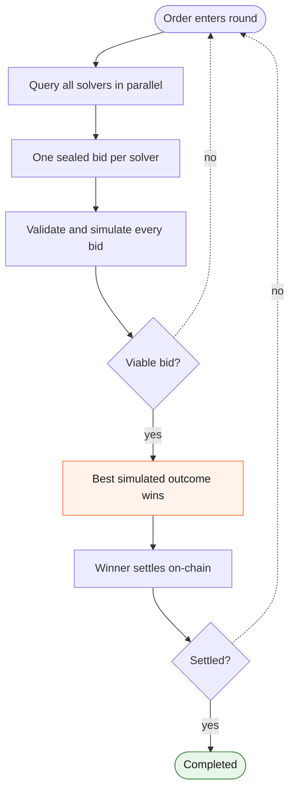

Sealed-bid auctions are a Portikus feature: they're how the [Portikus Network](/solver-network/portikus) fills intents for any app built on it, Delta included. In a sealed-bid auction, every bidder submits one private bid without seeing what anyone else offered. Every Delta order is filled through one: solvers bid blind, the bid with the best simulated outcome wins, and the settlement contract enforces the minimum the user signed. The result is a market where the only way for a solver to win is to quote its true best price.

## How a sealed-bid auction works

The mechanism is old and simple; governments have sold bonds and oil leases this way for a century. The auctioneer announces what's for sale, every bidder hands in one bid in a sealed envelope, and the envelopes are opened together. Best bid wins and pays what it bid (a *first-price* sealed auction).

What makes it interesting is what bidders can't do:

| | Open (English) auction | Sealed-bid auction |
|---|---|---|
| What bidders see | Every competing bid, live | Nothing |
| Winning strategy | Beat the runner-up by a tick | Quote your true best price |
| Reacting to rivals | Core of the game | Impossible |
| Manipulation surface | Shill bids, signaling, last-look sniping | One private commitment per bidder |

In an open auction the winner only ever pays slightly more than the second-best bidder was willing to. In a sealed auction a bidder who shades their offer risks losing outright to someone they couldn't see, so competitive pressure pushes every bid toward the bidder's real limit.

## Why this fits DeFi trading

Public blockchains leak information by default, and most trading attacks are built on that leak. A swap in the public mempool can be sandwiched before it lands. A visible quote can be undercut at the last moment by a competitor who never intended to price the trade honestly, only to beat whoever showed their hand first.

A sealed-bid auction removes the channel those attacks need. The order never touches a public mempool, so there's nothing to sandwich. Bids are private, so there's nothing to undercut by a tick; a solver that wants the order has to outbid rivals it cannot observe. This is the mechanism behind the MEV protection that [Why Delta](/delta/overview) promises.

## How Delta runs the auction

Every Delta order is auctioned in rounds. One round looks like this:

Three details do most of the work:

1. **A bid is a commitment, not a quote.** Solvers don't reply with a number; they reply with the exact calldata that executes the fill and the amount it delivers. There's no second look and no renegotiation after seeing the field.
2. **Bids are ranked by simulation, not by claim.** Before picking a winner, the order server simulates every bid against current chain state and ranks bids by what they actually produce. A solver that promises a great price but whose calldata reverts or underdelivers doesn't win.
3. **Surplus flows back.** When the winning fill beats the quoted price, the user receives the improvement; a portion is split between the integrator and the protocol. Solvers compete on execution quality, and users capture it.

If no viable bid arrives, or the winner's settlement fails on-chain, the order isn't stuck: it enters the next round and gets auctioned again, until it fills or its deadline expires.

## What stops a malicious solver

Each layer of the auction closes a different attack:

| Attack | Defense |
|---|---|
| Watch rivals' bids and undercut by a tick | Bids are sealed. Solvers see only the order, never each other's offers. |
| Claim a great price, deliver a bad fill | Every bid is simulated before the award. The ranking uses the simulated result, not the solver's claim. |
| Win the auction, then settle below the quote | The user's signed minimum is enforced by the settlement contract. A fill below it reverts on-chain. |
| Settle orders without participating honestly | Only solvers registered in the Portikus registry contract can settle. A misbehaving solver can be removed, and removal is enforced on-chain. |
| Win, then refuse to settle (griefing) | The order re-enters the next auction round. The user's funds never moved, so the failed solver wasted only its own auction slot. |

The pattern across all five: the auction never has to trust what a solver says. Bids are verified by simulation before the award, and the user's floor is verified by the contract after it.

## Related pages

- [Portikus Network](/solver-network/portikus) — the intent infrastructure that runs and settles these auctions.
- [How it works](/delta/how-it-works) — where the auction sits in the full Delta flow.
- [Why Delta](/delta/overview) — what the auction buys you as an integrator: gasless, MEV-protected swaps.
